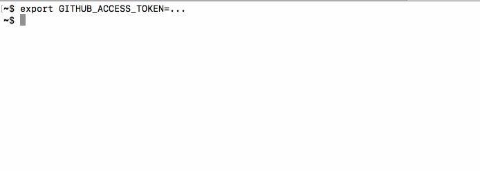

Fue
===

[](https://badge.fury.io/rb/fue)
[](https://travis-ci.org/dblock/fue)

Find an e-mail address of a Github user from their commit log.



## Usage

```
gem install fue
```

#### Get a Github Access Token

Obtain a Github access token from [here](https://github.com/settings/tokens) with `public_repo` permissions. See [help](https://help.github.com/articles/creating-a-personal-access-token-for-the-command-line) for more information. Set the token as `GITHUB_ACCESS_TOKEN`.

#### Find Someone's Email

The `find` command looks through user's initial repo commits.

```
GITHUB_ACCESS_TOKEN=token fue find defunkt

Chris Wanstrath <chris@ozmm.org>
Chris Wanstrath <chris@github.com>
```

#### Specify More Depth

By default the code looks at the last 10 repos. You can have more depth, up to 100 (a limit enforced by Github).

```
GITHUB_ACCESS_TOKEN=token fue find --depth=100 defunkt

Chris Wanstrath <chris@ozmm.org>
Chris Wanstrath <chris@github.com>
defunkt <chris@ozmm.org>
```

#### Get Help

```
fue help
```

Displays additional options.

## Contributing

There're [a few feature requests and known issues](https://github.com/dblock/fue/issues). Please contribute! See [CONTRIBUTING](CONTRIBUTING.md).

## Copyright and License

Copyright (c) 2018, Daniel Doubrovkine, [Artsy](http://artsy.github.io), with help from [Orta](https://github.com/orta).

This project is licensed under the [MIT License](LICENSE.md).
